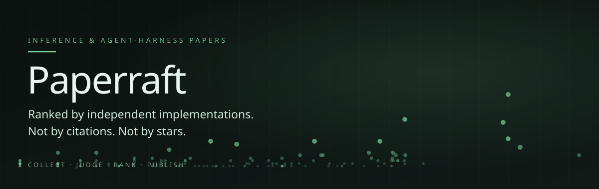

# ai-radar — a paper radar that ranks by independent implementations, not by hype.

[](https://github.com/lusknchars/ai-radar/actions/workflows/tests.yml)


ai-radar collects arXiv papers on efficient inference and agent harnesses, counts how many **independent** GitHub repositories implement each one, and publishes a daily digest plus a self-contained web archive. The archive opens with 30 concise paper briefs; a paper worth more attention can be expanded into a full-text report on demand. Papers that already broke out in attention are cut on purpose — the point is to find what nobody has looked at yet.



## Why independent implementations

Citations lag by a year. Stars measure whether a repository got posted somewhere. Neither tells you if a technique is worth your afternoon.

The bet here is that **people reimplementing a paper on their own** is an earlier and harder-to-fake signal. So the scoring is a gate, then a ratio:

```python
BROKE_OUT_STARS     = 1000
BROKE_OUT_CITATIONS = 200

if stars_total > BROKE_OUT_STARS or citations > BROKE_OUT_CITATIONS:
    return None                       # already broke out; not radar material

signal    = log1p(independent_impls) * (1 + 0.5 * log1p(velocity_14d))
attention = log1p(stars_total) + log1p(citations)
score     = signal / (1 + attention)
```

The gate exists because the ratio alone failed a real test case: with GPTQ's actual numbers (103 implementations, 3000 stars, 2500 citations), `log1p` compresses hard enough at the top that the most famous quantization paper in existence ranked **third**. A paper that already broke out is not radar material by definition — it does not get a low score, it does not get scored.

"Independent" means the repository owner is not an author. That is a declared heuristic — surname matching against the author list, plus abstract cross-reference — and every classification is published with the rule that fired it, so you can check it.

### Where the hypothesis currently fails

Measured on the 2026-08-29 seed of 1088 papers: of the 48 papers with 3+ independent implementations, **38 already have attention**.

| stars | papers |
|---|---|
| 0 | 3 |
| 1–9 | 7 |
| 10–99 | 13 |
| 100–999 | 17 |
| 1000+ | 8 |

The premise — implementation precedes attention — is **not supported by this snapshot**. Three explanations are still on the table and this data cannot separate them: the seed is a single point in time with no temporal axis; GitHub's `in:readme` search probably finds repositories of projects that already have traction; or the hypothesis is simply wrong. The daily re-check is the mechanism that will tell them apart.

This number is published on the site itself. A radar that hides evidence against its own premise is exactly the thing it exists not to be.

## How it works

```
arXiv API ──► scope filter ──► known-ID filter ──► Batch API (Claude) ──► judgment
                                                                            │
GitHub search ──► authorship heuristic ──► signal ◄── OpenAlex citations   │
                                                │                           │
                                                └──► gate → ratio → score ◄─┘
                                                              │
                                    ┌─────────────────────────┼──────────────┐
                                    ▼                         ▼              ▼
                              Telegram (3/scope)      Markdown archive   Static site
```

Two scopes run in sequence, each with its own term list, measured before being written into the spec:

| scope | categories | papers/day (measured) |
|---|---|---|
| `inferencia` | cs.LG, cs.CL, cs.DC, cs.AR, cs.PF | ~15 |
| `agentes` | cs.AI, cs.CL, cs.SE, cs.MA | ~25 |

The first scope to discover a paper keeps it. Overlap measured at **1%** — the two literatures are effectively disjoint.

Every paper gets the same structured judgment regardless of provider: a closed
taxonomy family with 19 values, an actionable verdict (`adotar`, `testar`,
`observar`, or `nao_aplica`), and any quantified gain claimed by the abstract.
The pipeline normalizes compatible gains to a multiplicative factor and labels
them **claimed by the authors, not verified** everywhere they appear. Kimi K3
and Claude both write this contract. Neither writes the ranking or editorial
conclusions.

## Two reading depths, three evidence states

The archive is meant to reduce reading time without pretending that an abstract
is evidence.

1. A **paper brief** is generated for every shortlisted paper from its title and
   abstract. It says what the technique replaces and why it deserves attention.
   Every brief has a permanent `/papers/<arxiv-id>/` research page and a public
   `index.json`. The page keeps eight exposure dimensions visible even when the
   honest answer is "not evaluated." The archive shows the 30 highest-scoring
   briefs first; search and filters still inspect the complete archive.
2. A **deep report** is generated only after the reader asks for one. It reads
   the official arXiv PDF, extracts the mechanism, central claims, baselines,
   mathematics worth reading, failure modes, and the smallest useful test.

A research page moves through three explicit states: `indexed` for abstract-level
screening, `source_mapped` after full-text analysis, and `independently_tested`
only when an external test can be linked. A finding is `source_linked` only when
the PDF page and matching excerpt are present. Everything else remains labeled
as an AI Radar inference or not evaluated.

Every deep report separates two infrastructure questions:

| Field | Meaning |
|---|---|
| validation tier | the smallest setup that can meaningfully falsify the idea on a local workload |
| evidence tier | the hardware used by the experiment supporting the paper's claim |
| infrastructure basis | whether that classification is explicit in the paper, inferred, or unknown |

The tiers are closed and visible: API/CPU, one 24 GB GPU, one 48–80 GB GPU,
multiple GPUs, cluster, custom hardware, or unknown. “Try it on one GPU” never
means “reproduce a cluster result.”

The static site never receives an API key. "Request deep report" opens a
prefilled GitHub issue and records public interest without spending credits. A
maintainer approves generation by changing the title prefix from
`[report request]` to `[report]`. The workflow checks who made that change,
validates the arXiv ID, downloads the PDF, uses Kimi, commits the versioned JSON
and rendered page, deploys the site, and comments with the permanent URL.
Reopening or duplicating an approved request is idempotent. An existing report
is republished, not regenerated.

Every evidence claim in a deep report asks Kimi for a PDF page and a short
verbatim excerpt. The pipeline checks that the excerpt exists on that exact
extracted page before publishing a page-level link. A failed check produces an
explicit “source not located” label instead of a citation that only looks
precise. Reports also link to the paper's arXiv page and complete PDF.

The report path has two PDF adapters. `pypdf` is the small default. Docling is
an opt-in deep parser for reading order, tables, and scanned pages. If Docling
fails, the report falls back to `pypdf` and records that fallback in the
versioned report JSON and the published page. Reports store separate SHA-256
hashes for the downloaded PDF and the extracted text. Official arXiv TeX
remains the source of exact formulas.

### Visual system

AI Radar is laid out as a research publication rather than a monitoring
dashboard. Its editorial index takes structural cues from
[Vetto Research & Blog](https://vetto.ai/companies/research-blog.html): a clear
issue header, dated research entries, compact decks, and a direct path into the
full article. AI Radar replaces Vetto's thumbnails with an evidence fingerprint
built from independent implementations, stars, citations, and claimed gain.
Those numbers earn their space because they explain why each paper entered the
issue.

The publication palette uses `#EEEEEE` as paper, `#000000` as ink, `#DDDDDD`
for secondary structure, and raspberry `#CB2957` for source links and actions.
Family colors use grayscale for inference papers and raspberry variations for
agent papers, so charts belong to the publication instead of looking like an
embedded analytics product.

The interface keeps the SheenButton interaction from the authored Halo family
in `frontend-lab` for report actions. Deep reports take structural cues from
[ProgramBench Vetted](https://vetto.ai/companies/programbench-vetted.html): a
sticky contents rail, a compact source bar, numbered sections, and exhibits
inside a narrow reading column. AI Radar puts the infrastructure comparison
first, then links every verified claim to the supporting PDF page. The palette,
components, copy, and generated markup remain AI Radar's own.

On small screens, each index row becomes a single-column research card. Internal
values such as `cache_kv` and `single_gpu_24gb` stay stable in data and filters,
while the interface renders labels such as "cache KV" and "1 GPU, até 24 GB".

Everything starts as semantic HTML and SVG generated by Python. There is no
React bundle, client build, remote font, or CDN request. Observable Plot and D3
are pinned locally as a progressive enhancement for chart exploration; the
audited server SVG remains visible if JavaScript or either asset is unavailable.

## Install

Requires Python 3.12+. For a publishable fork, the shortest path is:

```bash
gh repo fork lusknchars/ai-radar --clone --default-branch-only
cd ai-radar
./scripts/setup.sh
source .venv/bin/activate
```

The setup wizard creates `.venv`, installs the project, stores the Kimi key in
an ignored `.env`, creates an ignored `data/local.db`, derives the site URLs
from your fork, and optionally configures GitHub Actions. Its final check is
offline and does not spend LLM credits. Re-running it is safe.

If a fork enables Actions before adding an LLM key, the scheduled workflow
publishes the fixed 20-paper baseline instead of failing or calling a provider.
Adding the configured provider key switches later runs to the paid daily radar.

For a manual local-only setup:

```bash
git clone https://github.com/lusknchars/ai-radar.git
cd ai-radar
python3.12 -m venv .venv
source .venv/bin/activate
pip install -e ".[dev]"
cp .env.example .env                 # then add your key and GitHub username
ai-radar-doctor --init
```

Five Python runtime dependencies: `httpx`, `anthropic`, `pydantic`, `pypdf`,
and `python-dotenv`.
The frontend has no install or build step. Publication copies pinned local
Observable Plot 0.6.17 and D3 7.9 assets into the site. Charts first render as
Python SVG so geometry stays inside the tested boundary; Plot then adds linked
points, tooltips, responsive axes, and faceted views without replacing that
fallback contract. The library choice is documented in
[`docs/research/2026-09-02-chart-library.md`](docs/research/2026-09-02-chart-library.md).

Docling is optional because its document models and PyTorch dependencies are
too heavy for the daily metadata pipeline. Install it only on machines that
generate deep reports:

```bash
pip install -e ".[documents]"
export RADAR_PDF_EXTRACTOR=docling
```

The optional release is pinned to Docling 2.124.0. Its rollout and promotion
gate are recorded in
[`docs/plans/2026-09-02-evidence-pipeline.md`](docs/plans/2026-09-02-evidence-pipeline.md).

### Run

```bash
ai-radar-doctor                 # configuration check; no network
ai-radar --dry-run              # paid rehearsal; no durable state
ai-radar                        # paid daily run
```

`--dry-run` calls the configured LLM and can spend credits. It copies the
database to a temporary directory, so the rehearsal never consumes papers from
the first real run. Telegram is optional; when both Telegram variables are
absent, the archive is still generated and the command succeeds.

To generate one deep report locally after the paper is in the migrated archive:

```bash
export RADAR_LLM_PROVIDER=kimi
python scripts/gerar_relatorio.py --arxiv-id 2608.11111
```

This is a paid call. If `reports/2608.11111.json` already exists, the command
only republishes it and spends no additional credits.

### Validate the public research format

The repository includes a fixed corpus of 20 real papers selected from the Kimi
canary. It covers inference, agents, and adjacent research that should be
rejected as out of scope. Ten taxonomy families and all four recommendation
states are represented.

Prepare a current-schema database from the historical paper metadata and the
existing Kimi judgments. This step makes no network or model calls:

```bash
python scripts/verify_public_research_baseline.py
python scripts/prepare_public_research_eval.py
```

The first command performs the complete no-cost check inside a temporary
directory. CI runs it on every push. The second keeps the evaluation database
locally so the paid report commands can resume across sessions.

Start with one paid report, inspect it, then resume the full corpus. Existing
report JSON is skipped, so rerunning either command does not pay for completed
papers again.

```bash
python scripts/gerar_relatorio.py \
  --manifest eval/public-research-corpus.json \
  --db data/public-research-eval.db \
  --limit 1

python scripts/gerar_relatorio.py \
  --manifest eval/public-research-corpus.json \
  --db data/public-research-eval.db
```

The same progression is available as a manual GitHub Actions workflow. The
`canary` mode generates only the first report. Review its evidence links,
infrastructure labels, risks, and minimum test before starting the remaining
19. Each completed report that passes the progress check is committed before
the next run, so a retry skips work that already consumed credits. A rejected
report is kept as a workflow artifact for diagnosis and never reaches Pages.

```bash
gh secret set KIMI_API_KEY
gh workflow run research-corpus.yml -f mode=canary

# After reviewing the canary on GitHub Pages:
gh workflow run research-corpus.yml -f mode=remaining-corpus
```

The workflow reconstructs its evaluation database from tracked fixtures. It
then publishes every completed report, stores the current evaluation as a run
artifact, and deploys the static site. The progress check allows only two
unfinished conditions: fewer than 20 reports and no reader study. A malformed
page or a completed report without linked evidence, exposure analysis, risk,
or minimum test still fails the run.

The release gate reads the same public JSON served to readers and compares each
source-mapped page with its versioned report. It requires 20 valid reports, at
least one page-linked claim, one exposure finding, one risk, and one minimum
test per report. It also detects silent family or recommendation changes.

Generate the ignored `eval/reader-study.csv` with the balanced assignment
script. Each of five target readers receives four abstracts and four research
pages, with no repeated paper. Across the study, every paper appears once in
each condition. Record `reject`, `read`, or `test`, elapsed seconds, and the
reason for the decision. A reviewer then marks whether that reason invented a
risk or experimental condition.

```bash
python scripts/prepare_reader_study.py
python scripts/evaluate_public_research.py \
  --markdown eval/results/public-research-latest.md \
  --json eval/results/public-research-latest.json
```

The gate passes only when the research-page median is at most half the abstract
baseline and readers invent no risks or conditions. A failing report is useful:
it names the missing pages and weak report fields instead of hiding them behind
an aggregate score.

Anthropic remains available by setting `RADAR_LLM_PROVIDER=anthropic` and
`ANTHROPIC_API_KEY`. With no explicit provider, a lone Kimi key selects Kimi.
All other configurations preserve Anthropic as the default.

### LLM providers

Both adapters return `dict[str, Judgment]`, keyed by canonical arXiv ID. The
pipeline never sees an SDK response, reasoning trace, or provider-specific
error object.

| Provider | Daily judgment path | Structured output | Operational behavior |
|---|---|---|---|
| Kimi K3 | Chat Completions, one paper per request | strict JSON Schema; only final `message.content` is parsed | low reasoning effort, bounded retries, account-tier throttle |
| Kimi K2.6 | formula candidate selection only | strict JSON Schema over source candidate IDs | thinking disabled by default; cannot author source formulas or final report prose |
| Anthropic | Message Batches | Pydantic schema through `output_config.format` | results may arrive out of order and are joined by `custom_id` |

The exact provider and model are stored with every judgment. Changing models
therefore creates attributable data rather than silently rewriting the archive.
Kimi has separate international and China-platform credentials, so
`RADAR_KIMI_BASE_URL` must match the platform where the key and credits live.

### Migrate the committed archive

The committed database predates the current judgment schema. Reclassify it
with a reviewed Kimi canary before resuming the scheduled pipeline:

```bash
export RADAR_LLM_PROVIDER=kimi
export KIMI_API_KEY=...

python scripts/migrar_e_rejulgar.py --canary 20
# Review the 20 family, practice, and gain classifications printed above.
python scripts/migrar_e_rejulgar.py --execute
```

Kimi K3 has no Batch API, so the script checkpoints every completed judgment
in `data/rejudge-kimi.jsonl`. A stopped run resumes from that file without
paying for completed papers again. It does not alter `data/radar.db` until all
1,088 judgments exist. It also keeps a verified backup and restores it if the
distribution quality gate fails.

### Secrets

| Variable | Required | Purpose |
|---|---|---|
| `RADAR_DB` | no | database path; the wizard uses ignored `data/local.db` locally and `data/radar-state.db` in Actions |
| `RADAR_LLM_PROVIDER` | no | `kimi` or `anthropic` |
| `KIMI_API_KEY` | with Kimi | judgment and summary |
| `ANTHROPIC_API_KEY` | with Anthropic | judgment and summary |
| `RADAR_MODEL` | no | overrides the provider default model |
| `RADAR_FORMULA_MODEL` | no | formula selector; defaults to `kimi-k2.6` without changing the final report model |
| `RADAR_FORMULA_THINKING` | no | `enabled` or `disabled`; defaults to `disabled` |
| `RADAR_PDF_EXTRACTOR` | no | `pypdf` or optional `docling`; defaults to `pypdf` |
| `RADAR_KIMI_BASE_URL` | no | use `https://api.moonshot.cn/v1` for keys created on the China platform |
| `RADAR_KIMI_REQUEST_INTERVAL` | no | seconds between Kimi calls; defaults to 20 for the initial tier |
| `RADAR_REPOSITORY` | for a fork | GitHub `owner/repository`; Actions derives it automatically |
| `RADAR_SITE_BASE_PATH` | no | root-relative Pages path, such as `/ai-radar` |
| `RADAR_SITE_URL` | no | absolute public URL used by RSS |
| `TELEGRAM_BOT_TOKEN` | for push | daily digest |
| `TELEGRAM_CHAT_ID` | for push | digest destination |
| `GH_TOKEN` | no | raises the local GitHub search limit from 10 to 30 req/min; Actions provides it |

The setup wizard can perform the GitHub configuration. Manually, add
`KIMI_API_KEY` as a repository secret, select **GitHub Actions** as the Pages
source, and set the repository variable `RADAR_DB=data/radar-state.db` so your
fork starts with a current, independently persisted archive. You may also set
`RADAR_MODEL`, `RADAR_FORMULA_MODEL`,
`RADAR_FORMULA_THINKING`, `RADAR_PDF_EXTRACTOR`, and `RADAR_KIMI_BASE_URL` as
repository variables. Selecting `docling` makes the report workflow install
the optional document dependencies before generation.
`report.yml` fixes the provider to Kimi for this paid path;
`RADAR_LLM_PROVIDER` continues to select the daily brief adapter.

No key is needed for citations: OpenAlex resolves 50 papers per request with just a `mailto:` in the User-Agent. Semantic Scholar was measured first and rejected — unauthenticated, it returned `429` on the first call and succeeded 2 times out of 6.

## Architecture

The code has a pure decision core and a thin IO edge. `cli.py` is the composition
root. It reads configuration, selects concrete adapters, and passes their
interfaces into `run_day(...)`. The pipeline does not construct HTTP clients or
read credentials.

```text
                     adapters                       pure decisions

 arXiv --------> Discovery ----+
 Kimi/Claude ---> Judgment -----+--> run_day() --> DayResult --> Markdown/Telegram
 GitHub --------> Signal -------+       |
 OpenAlex ------> citations ----+       v
                                      Store
                                        |
                                        v
                                     SiteData --> public research model
                                        |              |
                                        v              v
                              HTML / RSS / editions   paper HTML + JSON
```

The on-demand path is separate from `run_day(...)`:

```text
paper action --> public request --> maintainer approval --> report workflow
                                                               |
                                                    official arXiv source
                                                           |             |
                                               PDF adapter + TeX          |
                                                  |        |              |
                                                  v        v              v
                                            page evidence  technical core K3 narrative
                                                           \             /
                                                            v           v
                                                    reports/<arxiv-id>.json
                                                             |
                                                   +---------+---------+
                                                   v                   v
                                             static report     source-mapped page
                                                                    |
 corpus manifest + reader study ------------------------------------+
                              |
                              v
                    public research release gate
```

The fixed-corpus workflow uses the same report generator and publisher. Its
manual `canary` and `remaining-corpus` modes add cost control and resumability;
they do not introduce a second report format.

The source reader never extracts an archive to disk and never compiles TeX. It
keeps only bounded `.tex` files in memory, rejects links and path traversal,
and gives every display equation a stable candidate ID before any model sees
the content.

### The main seams

| Seam | Interface | Adapters or consumers | Invariant kept behind it |
|---|---|---|---|
| discovery | `fetch_papers(scope) -> Discovery` | arXiv adapter | every rejected paper contributes a named cut |
| judgment | `judge_all(papers) -> dict[arxiv_id, Judgment]` | Kimi K3, Anthropic | provider output must satisfy the same closed schema |
| implementation signal | `fetch_signal(paper, day) -> Signal, repos` | GitHub adapter | author-owned repositories never count as independent |
| citations | `fetch_citations(ids) -> int or None` | OpenAlex adapter | unknown citations remain `None`, never a false zero |
| PDF extraction | `extract(pdf_bytes, arxiv_id) -> PdfExtraction` | pypdf, Docling with pypdf fallback | page markers, parser identity, and fallback reason travel together |
| archive read model | `Store.site_data(day) -> SiteData` | HTML, SVG, RSS renderers | presentation code never queries SQLite |
| public research | `build_research_page(paper, as_of, report=None) -> ResearchPage` | permanent paper HTML and JSON | source-linked requires a PDF page and excerpt; all eight exposure dimensions remain visible |
| research evaluation | `evaluate_public_research(manifest, site_root, reader_study_path=...) -> ResearchEvaluation` | fixed 20-paper corpus and reader study | a release cannot pass with missing reports, untraceable claims, empty risk/test fields, or unmeasured reader value |
| technical-core selection | `extract_technical_core(source, paper, selector) -> TechnicalCore` | K2.6 selector, report action | the model returns only candidate IDs and roles; exact LaTeX is copied from arXiv TeX and grounded to PDF prose |
| frontend rendering | `render_site(SiteData, ...) -> str` | publisher and archived editions | `site.py` owns semantic HTML and inert chart data; `site_assets.py` owns CSS and Plot enhancement; Python SVG remains the fallback |
| deep report | `generate_report(paper, full_text, judge, technical_core=..., provider=..., model=...) -> ReportDocument` | verified formula extraction and K3 narrative | K3 cannot author source formulas; evidence infra and minimum-test infra remain separate |
| publishing | `publish_site(store, root, day, reports_root=...)` | daily CLI, report workflow | rendering never starts collection or another paid judgment |

The judgment seam is now real rather than hypothetical. Kimi and Anthropic have
different request formats, rate limits, retry behavior, and batch semantics,
but callers learn one interface. The adapter owns that complexity. This keeps
provider changes local and lets the same pipeline tests exercise both paths
without network access.

`scoring.py`, `authorship.py`, `render.py`, `svg.py`, `site.py`, `site_assets.py`,
`leitura.py`, `site_data.py`, and `public_research.py` import no `httpx`,
`anthropic`, or `sqlite3`. A
test enforces that rule. Each page plus two pinned local chart assets form the
publication artifact. Renderers own semantic HTML and inert data; the asset
module owns design tokens, responsive CSS, and browser behavior.
The dither-wave background is an original, dependency-free 2D canvas effect:
it combines a standard 4x4 Bayer threshold with an independent warped sine
field. Its three wave colors match the visual settings chosen in Frontend Lab:
`#B92D5D`, `#FF8C82`, and `#FFE2D6`. It does not publish or reproduce the
private React Bits Pro source used as a visual reference. Motion stops when the
reader requests reduced motion, leaves the opening viewport, or moves the tab
into the background. Display headings use the official Electrolize Regular 400 Latin
WOFF2 build from Google Fonts. The publisher embeds it as a data URI, so the
single-file pages still make no font request. Its OFL 1.1 license is kept in
`assets/fonts/Electrolize-OFL.txt`.
PDF retrieval and extraction are isolated in `fulltext.py`. The report JSON
stores the PDF hash, extracted-text hash, parser, page count, and any parser
fallback. Page rendering stays deterministic and offline-testable. Network
adapters accept their transports by injection, so the test suite runs without
secrets.

### State and failure handling

`Store` owns SQLite writes and historical queries. Signals are append-only
because resurrection is a difference between observations, not a mutable field
on a paper. The upstream archive uses `data/radar.db`; configured forks use
`data/radar-state.db`. The selected Actions database is committed because each
runner is ephemeral. Without that state, every run would rejudge old papers and
deliver duplicates.

The composition root also owns failure policy:

- `--dry-run` works on a temporary database copy.
- A schema preflight stops before any network call when code and database do
  not match.
- Missing or invalid provider results become named `sem_julgamento` cuts
  instead of disappearing.
- The Kimi archive migration checkpoints each paid result before continuing.
- Public report requests spend no credits. Only a maintainer title change can
  start generation. The workflow validates a modern arXiv ID and never exposes
  the Kimi key to browser code.
- Site deployment only runs when `site/index.html` exists.

## What it deliberately does not do

**It does not reproduce papers.** No benchmark, no measurement. Every gain figure is an abstract claim, labeled as such in every place it renders.

**It does not tell you why.** The data supports "how many", never "why". The reading block on the site refuses causal and predictive language, and there is a test over the whole output that enforces it.

**It does not hedge.** Each generated statement carries a guard; a statement whose guard fails is **omitted**, not softened. A block with two solid sentences beats one with six full of "may indicate that".

**It does not use an LLM to write conclusions.** The reading block is arithmetic in a pure function. A model writing those sentences would invent correlation with perfect fluency, and be indistinguishable from correct computation to whoever reads it.

## Status

Pre-1.0, and honest about it.

- The upstream scheduled workflow cannot complete until its historical database is migrated.
- GitHub Pages uses GitHub Actions on `main`; a configured fork publishes from its own `data/radar-state.db`.
- The historical `data/radar.db` committed upstream is still on the pre-migration schema.
- Fresh clones use an ignored, current-schema `data/local.db`; forks configured by the wizard persist their own current-schema `data/radar-state.db`. Neither needs to migrate or pay to rejudge the original archive.
- The 20-paper Kimi connectivity canary completed; the full archive re-judgment remains pending.
- The same 20 papers now form a reproducible public-research corpus. All 20
  indexed pages pass structural validation; the release gate remains red until
  deep reports and the five-reader study exist.
- A manual corpus workflow now runs one paid canary before the remaining
  reports, republishes partial progress, and rejects weak completed reports.
  The upstream repository still needs its `KIMI_API_KEY` Actions secret before
  that paid path can run.
- RSS, permanent paper URLs and JSON, stable daily-edition URLs, the exposure map, the editorial redesign, and the two-scope pipeline are done and tested.
- The 30-brief archive and maintainer-approved, full-text report path are
  implemented but remain unproven in the default-branch Actions environment.

The test suite runs offline and completes in about one second on the current development machine.

## License

Not chosen yet. Until one is added, default copyright applies — no permission granted to use, copy, or distribute.
