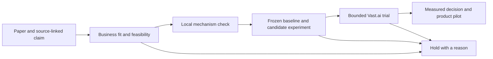

# From a paper to a useful inference experiment

AI Radar now has a local experiment runner. It checks an experiment contract,
runs deliberately configured baseline and candidate adapters, saves their raw
measurements, and applies deterministic comparison rules. It never provisions
GPUs. The existing paper ranking and public editorial status remain reading aids.

The first target is lower-cost or faster LLM inference for a SaaS workload.
The question is whether a technique improves a specific service at acceptable
quality and total cost. A published speedup alone cannot answer that question.

The first prepared GPU trial is [GLM-4.7-Flash with native MTP](../experiments/glm47-mtp/README.md).
It includes a source review, 40 generated tasks, a pinned runtime image and model,
and an adapter that measures complete responses. It has not run on a GPU yet.



## Triage before paying for hardware

| Gate | Required evidence | Hold when |
|---|---|---|
| Business fit | Named endpoint, real bottleneck, measurable improvement | The technique optimizes a workload the service does not run |
| Paper evidence | Full-text report and at least one located source claim | Only an abstract or an unlocated claim is available |
| Feasibility | Model/runtime compatibility, pinned implementation, license review, data access | Custom kernels or training exceed available resources |
| Local mechanism | Small correctness check, error handling, adapter contract | The implementation changes semantics unexpectedly |
| Experiment contract | Frozen dataset, baseline, quality metric, thresholds, repeat seeds, budget | Inputs or pass criteria are still moving |
| GPU measurement | Repeated comparisons on the same rented host | Gain vanishes, quality regresses, cost rises, or the run is incomplete |
| Product pilot | Representative traffic, rollback, operational ownership | Infrastructure savings do not cover integration and operating costs |

These are engineering decisions. The runner can check completeness and compare
numbers; a filled text field does not prove model compatibility or license suitability.

## A runnable first check

The initial example uses the probability correction in
[Fast Inference from Transformers via Speculative Decoding](https://arxiv.org/abs/2211.17192).
The paper proposes drafting tokens cheaply and checking them with the target
model while preserving the target distribution. This makes a useful correctness
exercise before testing whether a particular model pair is faster.

```bash
cd /Users/luskoliveira/ai-radar
.venv/bin/python scripts/check_speculative_sampling.py \
  --out eval/results/speculative-mechanism.json
```

This runs 25 small cases, including disjoint support, zero probabilities,
identical distributions, and skewed distributions. It enumerates the one-token
accepted and corrected probability mass and compares it with the target.
The artifact explicitly records that no LLM ran and no GPU speedup was measured.
It does not test multi-token verification, KV-cache rollback, a runtime's sampler,
floating-point behavior on GPUs, or throughput. Passing this check alone never
promotes a paper to independently tested or authorizes a rental.

Speculative decoding is a starting example, not a selected production dependency.
The GPU experiment still needs a compatible, pinned target/draft pair and runtime.
If the service's bottleneck is memory capacity or prefill instead of decoding,
triage a relevant compression or prefill technique before proceeding.

## Create an experiment

The command works without reinstalling the environment:

```bash
.venv/bin/python -m radar.validation init 2211.17192 \
  --out .private/experiments/speculative/plan.json
.venv/bin/python -m radar.validation check .private/experiments/speculative/plan.json
```

After `pip install -e '.[dev]'`, the same interface is available as
`ai-radar-validate`. The generated draft deliberately fails preflight until
the real inputs are provided. All relative paths and adapter commands resolve
from the plan's directory. Commands are executable/argument arrays, with no shell
expansion. Explicitly use the intended Python interpreter, not a shell alias.

Fill `report_path` with an existing versioned deep-report JSON. Generation of a
deep report remains the separate report-request workflow. Preflight accepts its
existing legacy format migration and checks that its paper ID matches.

Create a JSONL dataset with at least 20 distinct, nonempty string `case_id` values.
Include prompts, expected answers or checks, and any workload-specific fields
your adapter needs. Use sanitized representative SaaS inputs and hold out an
evaluation set from any tuning. Include short/long prompts, constrained outputs,
code, repeated prefixes, and failure cases if they occur in the service.
Twenty cases is a smoke-test floor, not a production-sized performance study.

Record the file's SHA-256 as `dataset_sha256`. Pin the implementation commit,
model and tokenizer revisions, runtime/container, generation settings, and
dependency lockfile in `implementation_ref` and `environment_ref`.
Record the quality rubric in `quality_metric` and actual host in `hardware`.
These are operator declarations; the runner does not attest to remote hardware.

For the first inference trial, use the same target model in both arms. Disable
speculation for baseline and enable the chosen draft for candidate. Fix prompt
inputs, output limits, stop conditions, sampling settings, concurrency, and the
quality evaluator. Warm both paths before measuring. Include draft-model memory
and startup costs. Seeds must actually be applied by the adapter.

Suggested initial thresholds, to agree before collecting measurements:

| Parameter | Starting hypothesis |
|---|---|
| Primary metric | At least 10% lower p95 end-to-end latency |
| Quality floor | At least 0.80 on a defined normalized task score |
| Allowed quality drop | At most 0.01 absolute score |
| Repeats | Seeds 17, 42, and 93 |
| Cost | Lower cost per quality-passing response, including idle/startup overhead |

The quality thresholds are placeholders until calibrated to the workload. The
runner gates one primary metric and the quality floor/drop. It records mean
request cost but does not yet gate multiple performance objectives or calculate
cost per quality-passing response. Inspect those business metrics before a pilot.

## Adapter protocol and artifacts

Each adapter reads a JSON object from stdin containing `cases`, `seed`, and `arm`.
It executes the workload and prints one JSON array to stdout. Logs go to stderr.
Every case must appear exactly once, including failures. For failed requests,
record quality zero and the actual elapsed time and cost; do not omit them.
For example, the shape of a single observation is:

```json
{"case_id":"short-001","quality":0.9,"latency_ms":152.4,"cost_usd":0.0003}
```

Those numbers illustrate the format, not a benchmark. Scores must be finite and
normalized to [0, 1], latency positive, and costs nonnegative. The adapter is
responsible for honest measurement and quality evaluation. Warmup/model loading
must fit within `timeout_seconds`, which applies to each arm and seed.
The current protocol supports sequential batches; load testing and streaming
TTFT/TPOT/VRAM telemetry require workload-specific instrumentation.

```bash
.venv/bin/python -m radar.validation run .private/experiments/speculative/plan.json \
  --out .private/experiments/speculative/run-001.json
```

The runner alternates which arm goes first, preserves all observations per seed,
records the full plan and report/dataset hashes, and requires every repeat to
pass. It uses the nearest-rank p95 latency, mean quality, and mean request cost.
This is a conservative smoke gate, not statistical significance or a confidence
interval. Use more representative cases and report uncertainty for adoption.

| Decision | Meaning |
|---|---|
| `blocked` | Preflight omissions; no adapter ran |
| `incomplete` | Execution, coverage, timeout, or input-integrity failure |
| `revise` | At least one measured comparison missed a threshold |
| `ready_for_gpu_trial` | Local comparison passed; GPU behavior remains unmeasured |
| `ready_for_workload_validation` | GPU smoke comparison passed; representative workload testing remains |
| `ready_for_product_pilot` | GPU comparison declared as workload evaluation passed; human review still needed |

`evaluation_scope` defaults to `smoke`. Set it to `workload` only when the dataset
and evaluation actually represent the intended product workload. Optional
`maximum_case_quality_drop` catches paired regressions even if gains on other
cases hide them in the mean. The GLM trial allows no such case regressions.

Artifacts are never overwritten. A local CPU proxy may not exhibit a GPU
technique's speedup. Record that limitation instead of loosening thresholds to
force a pass. A GPU-only method can proceed to an explicitly reviewed exploratory
trial after its mechanism check, with performance marked unknown. The CLI does
not manufacture a passing local performance result for that case.

## Vast.ai trial handoff

The manifest stores a proposed budget, not spending authorization or an enforced
cloud limit. No account was accessed and no GPU was rented for this implementation.
Set `max_hourly_usd`, `max_hours`, `storage_and_transfer_allowance_usd`, and
`max_trial_usd` before a trial. Preflight checks:

```text
hourly ceiling × maximum hours + storage/transfer allowance ≤ trial budget
```

Example arithmetic only: $0.50/hour × 2 hours + $1 allowance = $2. This is not a
current offer or price estimate. Include model downloads, boot time, and storage.
Adapters may themselves call paid services; subprocess timeouts do not enforce
a dollar limit or stop a cloud instance.

Vast's [CLI guide](https://docs.vast.ai/cli/hello-world) documents the sequence:
search offers, register SSH access, create an instance, wait with a deadline,
run, copy results out, and destroy the instance. Its
[billing documentation](https://docs.vast.ai/guides/reference/billing) explains
GPU, storage, and transfer charges. Stopping an instance leaves storage billing;
destroy it after exporting the evidence.

The next implementation should provide a separate provider adapter with:

1. Read-only offer search using measured VRAM/runtime requirements and a price ceiling.
2. A reviewed experiment bundle with pinned container, code, models, dataset hash,
   exact commands, expected runtime, and total proposed spend.
3. Durable tracking of the created instance ID and a bounded readiness check.
4. Baseline and candidate on the same host, recording GPU/driver/runtime identity,
   peak VRAM, latency, throughput, output lengths, quality, and actual charges.
5. Artifact export before teardown, teardown verification, and a recovery command
   if the local controller crashes. A local `finally` block alone is insufficient.

No monthly token or infrastructure forecast is meaningful until model, request
volume, context lengths, utilization, and pricing are known. The first paid
trial should estimate those from measurements, then compare the resulting
cost per successful request with the current SaaS baseline.

## Regression workflow

For each bug, record the trigger, expected behavior, observed failure, and a
minimal fixture. Fix the narrow cause, run the relevant tests, then the repository
suite. Keep benchmark behavior tests separate from fabricated protocol fixtures.

```bash
.venv/bin/python -m pytest tests/test_validation.py tests/test_speculative_sampling.py -q
.venv/bin/python -m pytest -q
.venv/bin/python scripts/verify_public_research_baseline.py
```

No existing bug was reproduced by the initial 671-test baseline. New regression
tests cover quality loss despite speedup, missing/duplicate cases, tail latency,
zero-cost comparisons, nonfinite observations, stale datasets, missing source
links, timeouts, adapter crashes, and preservation of result files.
